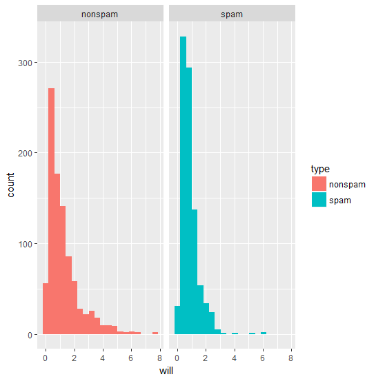
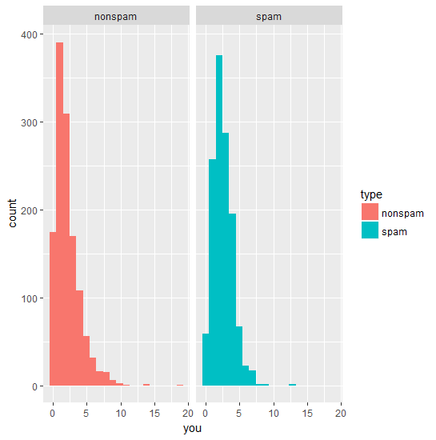
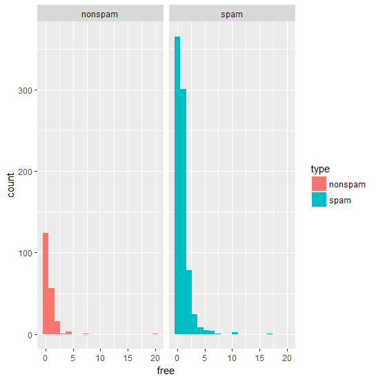
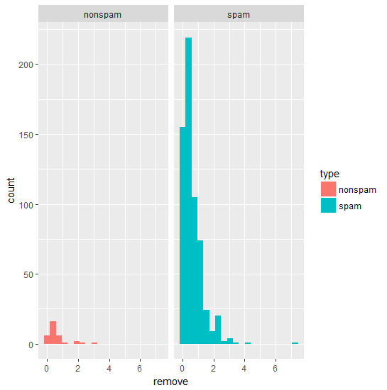
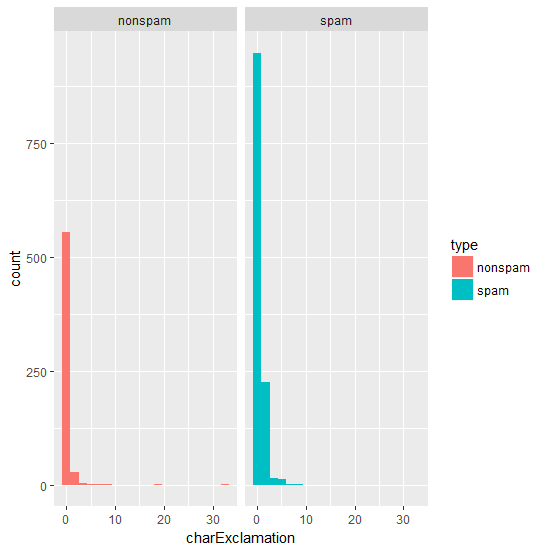
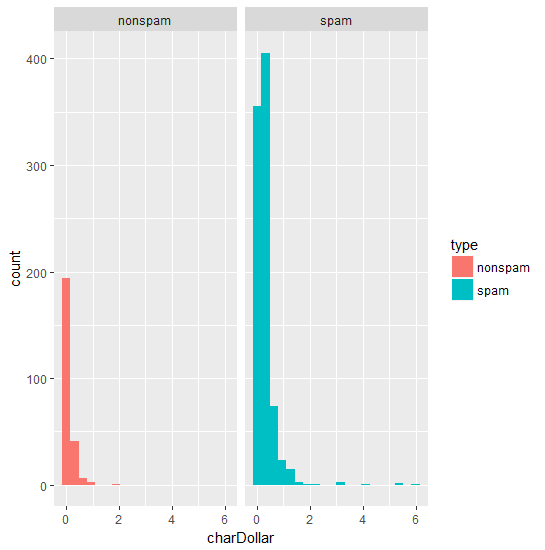
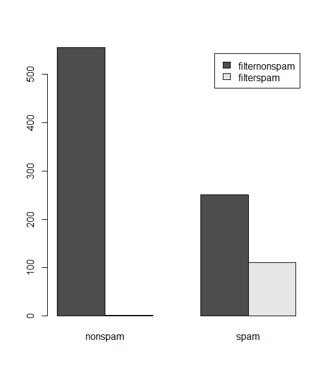
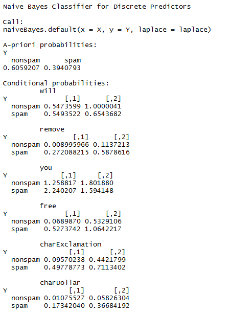

# Spamfilter Resultate

## Histogram von vorkommenden Tokens

## einzelne Ergebnisse
### Propability (Spam|Event)
* will: 0.9317794
* you: 0.9327523
* free: 0.9818349
* remove: 0.9961374
* charExclamation: 0.9655759
* charDollar: 0.9803652
* **0.9989724** (Bestes Ergebnis mit threshold 0.1, probiert 0.2, 0.1 und 0)

### threshold grösser als 0 charExclamation

|         | nonspam           | spam  |
| ------------- |:-------------:| :-----:|
| filternonspam     | 1638 | 249 |
| filterspam     | 593 |  1202  |

Es werden noch fast 600 Mails als spam vom filter erkannt, obwohl sie eigentlich nicht spam sind.

### threshold grösser als 1 charExclamation

|         | nonspam           | spam  |
| ------------- |:-------------:| :-----:|
| filternonspam     | 2201 | 1261 |
| filterspam     | 30 |  190  |

Nun haber wir über 1200 spam Mails in der Mailbox :(

### threshold grösser als 0 remove

|         | nonspam           | spam  |
| ------------- |:-------------:| :-----:|
| filternonspam     | 2198 | 836 |
| filterspam     | 33 |  615  |

Mit Remove werden viel weniger als spam erkannt obwohl es gar keine spam Mails sind

### threshold grösser als 1 remove

|         | nonspam           | spam  |
| ------------- |:-------------:| :-----:|
| filternonspam     | 2226 | 1327 |
| filterspam     |  5 |  124  |

Fast keine mehr werden fälschlicherweise als spam erkannt, dafür landen viele Spam Mails im Posteingang.

### threshold grösser als 0 remove und charExclamation

|         | nonspam           | spam  |
| ------------- |:-------------:| :-----:|
| filternonspam     | 2212 | 911 |
| filterspam     |  19 |  540  |

### threshold grösser als 0.1 free und remove
threshold 0.1 weil bei free die meisten welche als spam klassifiziert wurden bei ca 0.1 sind. (siehe plot zu free)
#### Training
|         | nonspam           | spam  |
| ------------- |:-------------:| :-----:|
| filternonspam     | 2227 | 1170 |
| filterspam     |  4 |  281  |

#### Testing
|         | nonspam           | spam  |
| ------------- |:-------------:| :-----:|
| filternonspam     | 555 | 251 |
| filterspam     |  2 |  111  |

**Barchart**

## Ergebnisse von der Naive Bayes Library

### Naive Bayes Model

### Resultate von Model mit TestSet
|         | nonspam           | spam  |
| ------------- |:-------------:| :-----:|
| filternonspam     | 540 | 143 |
| filterspam     |  17 |  219  |

